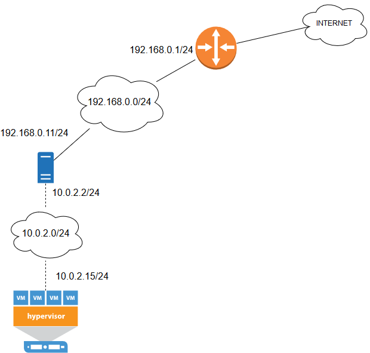
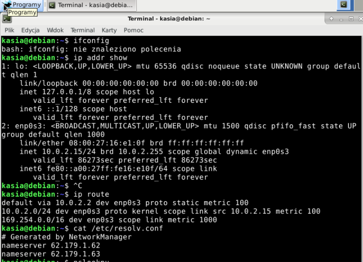
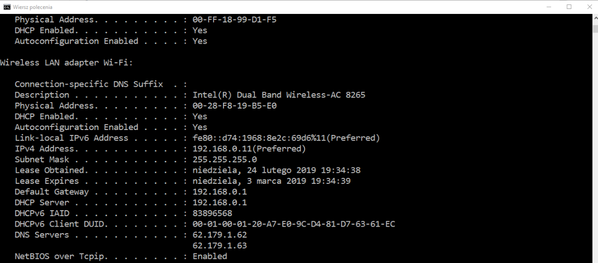

System operacyjny w środowisku sieciowym
=========================================

Charakterystyka systemu operacyjnego
------------------------------------

| Charakterystyka | wartość           | komentarzu |
| ------------- |:-------------:| -----:|
| nazwa      | linux | debian |
| nazwa      | windows |  |
| program (parametry sieci)      | niewiem |  |


Konfiguracja połączenia sieciowego windows
----------------------------------

| Parametr | wartość           | komentarzu |
| ------------- |:-------------:| -----:|
| Adres IP      |192.168.0.11 | przydzielony przez DHCP |
| Maska podsieci      | 255.255.255.0 |  |
| Brama      | 192.168.0.1 |  |
| DNS 1      | 62.179.1.62 |  |
| DNS 2      | 62.179.1.63 |  |

Konfiguracja połączenia sieciowego linuxik
----------------------------------

| Parametr | wartość           | komentarzu |
| ------------- |:-------------:| -----:|
| Adres IP      |10.0.2.15 | przydzielony przez DHCP (ip addr show) |
| Maska podsieci      | 255.255.255.0 |  |
| Brama      | 10.0.2.2 | (ip route) |
| DNS 1      | 62.179.1.62 | cat /etc/resolv.conf |
| DNS 2      | 62.179.1.63 |  |

Schemat sieci
-------------





aby załączyć obrazek 

```markdown


```
