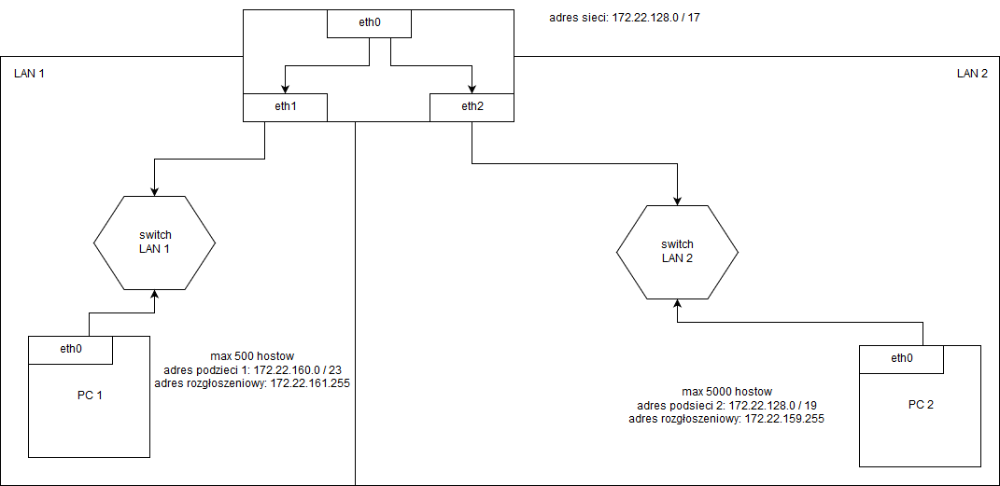

Zadanie 1
---------


1. Zaprojektuj oraz przygotuj prototyp rozwiązania z wykorzystaniem oprogramowania ``VirtualBox`` lub podobnego. 
Zaproponuj rozwiązanie spełniające poniższe wymagania:
   * Usługodawca zapewnia domunikację z siecią internet poprzez interfejs ``eth0`` ``PC0``
   * Zapewnij komunikację z siecią internet na poziomie ``LAN1`` oraz ``LAN2``
   * Dokonaj takiego podziału sieci o adresie ``172.22.128.0/17`` aby w ``LAN1`` można było zaadresować ``500`` adresów natomiast w LAN2 ``5000`` adresów    
   * Przygotuj dokumentację powyższej architektury w formie graficznej w programie ``DIA``
 
 
 ROZWIĄZANIE:
 ---
 
 Adres sieci: 172.22.128.0/17
 
 Sieć należy podzielić na 2 podsieci:
 - podzieć 1 (LAN 1 - 500 hostów) 
    - adres LAN 1: 172.22.160.0 / 23
    - host 1: 172.22.160.1
    - host ostatni: 172.22.161.254
 - podsieć 2 (LAN 2 - 5000 hostów)
    - adres LAN 2: 172.22.128.0 / 19
    - host 1: 172.22.128.1
    - host ostatni: 172.22.159.254
    
    
 VirtualBox komendy:
 
 PC 0 (router):
 ```
 ip addr show
 ip addr add 172.22.160.3 dev enp0s3
 ip addr add 172.22.128.3 dev enp0s8
 echo 1 | sudo tee /proc/sys/net/ipv4/ip_forward
 ```
 
 PC 1:
 ```
 ip addr show
 ip addr add 172.22.160.1/23 dev enp0s3
 ip route add default via 172.22.160.3
 ```
 
 PC 2:
 ```
 ip addr add 172.22.128.1/19 dev enp0s3
 ip route add default via 172.22.128.3
 ```
    

  
    
